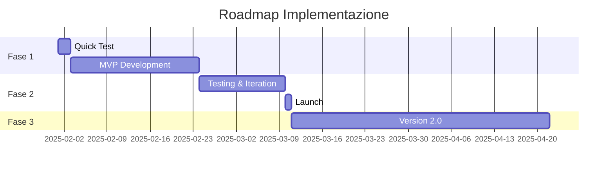

# 📚 Prompt Fase 4: DOCUMENT (Documenta Idea)

> Usa questo prompt per creare documentazione completa e strutturata dell'idea.

---

## 📋 Istruzioni

1. Completa prima le fasi CAPTURE, ELABORATE e VALIDATE
2. Assicurati che la decisione sia GO (🔵 To Do)
3. Copia il prompt sotto
4. Allega tutti i file precedenti (raw, elaborated, validated)
5. Salva l'output in `idea-XXX-complete.md`

---

## 💬 PROMPT

Ho validato questa idea e voglio creare documentazione completa prima di implementare:

**File Precedenti:**
- Idea Raw: [INCOLLA idea-XXX-raw.md]
- Idea Elaborated: [INCOLLA idea-XXX-elaborated.md]
- Idea Validated: [INCOLLA idea-XXX-validated.md]

**Crea documentazione completa seguendo questa struttura:**

---

## 📋 Struttura Documentazione

### 1. 🎯 Executive Summary

Riassunto completo dell'idea in 4-6 paragrafi che includa:
- Cos'è l'idea in sintesi
- Problema che risolve
- Soluzione proposta
- Valore/impatto atteso
- Decisione di procedere e perché

### 2. 📖 Descrizione Dettagliata

Espansione completa dell'idea con:
- **Contesto**: Da dove nasce, background
- **Problema**: Analisi approfondita del problema
- **Soluzione**: Come l'idea lo risolve in dettaglio
- **Beneficiari**: Chi ne beneficia e come
- **Differenziazione**: Cosa la rende unica/diversa

### 3. 🎯 Obiettivi e Metriche

**Obiettivo Principale:**
[Definizione chiara e misurabile]

**Obiettivi Secondari:**
- [Obiettivo 1 con metrica]
- [Obiettivo 2 con metrica]
- [Obiettivo 3 con metrica]

**Success Criteria:**
Come saprai che ha avuto successo?
- [Criterio 1 - misurabile]
- [Criterio 2 - misurabile]
- [Criterio 3 - misurabile]

**Timeline Obiettivi:**
- Short term (1-3 mesi): [Obiettivi]
- Mid term (3-6 mesi): [Obiettivi]
- Long term (6-12 mesi): [Obiettivi]

### 4. 🏗️ Architettura/Design

**Se applicabile (progetti tech/creativi), includi:**

**High-Level Architecture:**
[Descrizione componenti principali e come interagiscono]

**Diagrammi:**
Genera diagrammi in formato Mermaid o PlantUML:
- Architecture diagram
- Data flow diagram
- User flow (se applicabile)

**Stack Tecnologico** (se tech):
- [Tecnologia 1]: [Perché questa scelta]
- [Tecnologia 2]: [Perché questa scelta]

**Design Principles:**
- [Principio 1]
- [Principio 2]

### 5. 📋 Requisiti

**Requisiti Funzionali:**

| ID | Requisito | Priorità | Note |
|----|-----------|----------|------|
| RF-001 | [Descrizione] | Must-have | [Note] |
| RF-002 | [Descrizione] | Should-have | [Note] |
| RF-003 | [Descrizione] | Nice-to-have | [Note] |

**Requisiti Non-Funzionali:**
- Performance: [Requisiti]
- Scalabilità: [Requisiti]
- Sicurezza: [Requisiti]
- Usabilità: [Requisiti]

**Vincoli:**
- [Vincolo 1]
- [Vincolo 2]

### 6. 🔄 Fasi e Milestone

**MVP (Versione 1.0):**
- **Obiettivo**: [Cosa deve fare MVP]
- **Features Core**: [Lista 3-5 feature essenziali]
- **Timeframe**: [Tempo stimato]
- **Success Criteria**: [Come validare MVP]

**Versione 2.0:**
- **Aggiunte**: [Cosa si aggiunge dopo MVP]
- **Timeframe**: [Tempo stimato]

**Versione Future:**
- [Visione long-term]

**Roadmap Dettagliata:**

### 7. 🔍 Alternative Considerate

**Alternative Analizzate:**

**Alternativa A: [Nome]**
- Pro: [Lista pro]
- Contro: [Lista contro]
- Perché scartata: [Ragione]

**Alternativa B: [Nome]**
- Pro: [Lista pro]
- Contro: [Lista contro]
- Perché scartata: [Ragione]

**Perché Approccio Scelto:**
[Ragionamento della scelta finale]

### 8. ⚠️ Rischi e Mitigazioni

| Rischio | Probabilità | Impatto | Mitigazione | Owner |
|---------|-------------|---------|-------------|-------|
| [Rischio 1] | Alta/Media/Bassa | Alto/Medio/Basso | [Come mitigare] | [Chi] |
| [Rischio 2] | | | | |

**Contingency Plans:**
- Se [scenario X]: [Piano B]
- Se [scenario Y]: [Piano B]

### 9. 📅 Timeline e Milestones

**Timeline Completa:**

**Fase 1: Quick Test** (Giorni 1-2)
- [ ] [Task 1]
- [ ] [Task 2]
- **Checkpoint**: [Decision point]

**Fase 2: MVP Development** (Settimane 1-3)
- [ ] [Task 1]
- [ ] [Task 2]
- **Milestone**: MVP completato

**Fase 3: Testing** (Settimane 4-5)
- [ ] [Task 1]
- [ ] [Task 2]
- **Milestone**: Validato e testato

**Fase 4: Launch/Deploy** (Settimana 6)
- [ ] [Task 1]
- [ ] [Task 2]
- **Milestone**: In produzione/pubblicato

**Fase 5: Iteration** (Ongoing)
- Cicli di feedback e miglioramento

### 10. 💰 Risorse Necessarie

**Tempo:**
- Stima totale: [X ore/giorni/settimane]
- Breakdown per fase: [Dettaglio]

**Competenze:**
- [Competenza 1]: [Ho già / Devo acquisire]
- [Competenza 2]: [Ho già / Devo acquisire]

**Tools/Servizi:**
- [Tool 1]: [Costo se applicabile]
- [Tool 2]: [Costo se applicabile]

**Budget Totale** (se applicabile):
[Stima costi]

### 11. 🔗 Collegamenti

**Idee Correlate:**
- [Link a Idea #XXX]: [Come si connette]
- [Link a Idea #YYY]: [Come si connette]

**Progetti/Risorse Esterne:**
- [Progetto/Risorsa 1]: [Relevanza]
- [Progetto/Risorsa 2]: [Relevanza]

**Dipendenze:**
- Questa idea dipende da: [Cosa]
- Altre idee che dipendono da questa: [Quali]

### 12. 📝 Note e Considerazioni

**Decisioni di Design:**
- [Decisione 1]: [Perché presa]
- [Decisione 2]: [Perché presa]

**Trade-off Accettati:**
- [Trade-off 1]: [Ragionamento]
- [Trade-off 2]: [Ragionamento]

**Open Questions:**
- [Domanda 1 ancora senza risposta]
- [Domanda 2 ancora senza risposta]

**Lessons Learned** (da aggiornare durante implementation):
- [Lesson 1]
- [Lesson 2]

---

## 📊 Appendici

### Appendice A: Glossario
- **Termine 1**: Definizione
- **Termine 2**: Definizione

### Appendice B: Riferimenti
- [Documento 1]
- [Documento 2]

---

## ✅ Checklist Completezza Documentazione

Prima di considerare la documentazione completa, verifica:

- [ ] Executive summary chiaro e completo
- [ ] Problema e soluzione ben descritti
- [ ] Obiettivi misurabili definiti
- [ ] Architettura/design documentato (se applicabile)
- [ ] Requisiti funzionali e non-funzionali listati
- [ ] Roadmap con timeline realistiche
- [ ] Alternative considerate e ragionamento
- [ ] Rischi identificati con mitigazioni
- [ ] Risorse necessarie stimate
- [ ] Collegamenti ad altre idee/progetti
- [ ] Diagrammi creati (se necessari)

---

**Output formato:** Markdown completo, ben strutturato, ready for implementation.

---

## 📝 Dopo il Prompt

1. ✅ Salva output in `ideas/idea-XXX-complete.md`
2. ✅ Genera diagrammi (se inclusi) e salva in `ideas/diagrams/`
3. ✅ Review documentazione per completezza
4. ✅ Aggiorna stato tracker: 🔵 To Do → 🔵 Documented
5. ✅ Prossimo step: Fase PREPARE (genera artifacts)
6. ✅ Condividi documentazione con stakeholder (se applicabile)

---

*Prompt da IdeaFlow Framework - https://github.com/disoardi/ideaflow*
